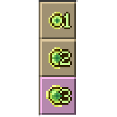
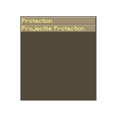
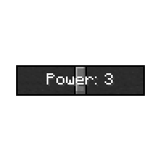
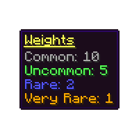

---
navigation:
  title: 'The Info Menu'
  icon: 'apotheosis:textures/gui/book/question_mark.png'
  parent: apotheosis:enchanting/table.md
---

# The Info Menu

The enchanting table has a helpful screen to let you learn about what enchantments are available.

To access it, place an item in the enchanting table, and click the question mark in the top right.

The purpose of this chapter is to introduce this screen, and help you navigate it.

If you have a full understanding of it, you'll never be confused by enchanting again.

## The Slot Selector

This lets you select which enchanting slot to inspect.

The currently selected slot will be highlighted, and slots that are not available will be grayed out.

Hovering the slot will show you the level, the <Color id="dark_red">Min Power</Color> and the <Color id="blue">Max Power</Color>.

## Enchantments Window

This shows you what enchantments are available.

Given the current item, and the currently selected power level, a certain array of enchantments are available.

This window shows you each enchantment, their level, rarity, and chance of being selected.

It will also show what enchantments are exclusive with each other.

## The Power Slider

This lets you change the simulated power level.

When you select a slot, the Power Slider automatically selects the power level directly in the middle of the power range.

The slider can only go down to the <Color id="dark_red">Min Power</Color> and up to the <Color id="blue">Max Power</Color> for the current slot.

## Rarity Weights

This shows the weight of each rarity.

Every enchantment has a rarity, and each rarity has a weight.

The chance of selecting an enchantment is its individual weight divided by the total pool (of the weights of all available enchantments).

<Color id="dark_purple">Arcana</Color> can change the rarity weights.
