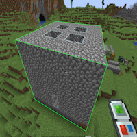
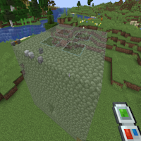
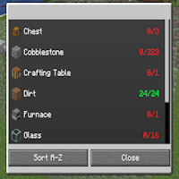
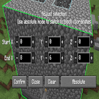
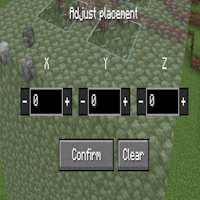

---
navigation:
  title: 'Copy Paste Gadget'
  icon: 'buildinggadgets2:gadget_copy_paste'
  position: 3
  parent: buildinggadgets2:gadgets.md
---

# Copy Paste Gadget

The copy paste gadget makes replicating structures far easier! To start, ensure you're in 'copy' mode in the settings menu.

Right click one corner of a structure,and then shift-right click an opposing corner. If done correctly, a green outline will surround your structure.

## Copying

Copying a structure

TODO: Unsupported flag 'border'

Switch the gadget to 'paste' mode, and you'll see a ghostly preview of the structure you've copied. The block you right clicked during copying is the starting point of the structure.

To place the structure in world, simply right click! All items necessary for building will be removed from your inventory, and any blocks you don't have items for will be skipped.

## Paste Preview

Previewing a paste

TODO: Unsupported flag 'border'

To see a list of the items you need, open the settings menu and choose the 'material list' option.

This is a scrollable list showing what items you do or do not have, and can be sorted in multiple ways. Try it out!

## Material List

Needed items

TODO: Unsupported flag 'border'

Its possible to make fine tuned adjustments to the copy area by opening the Adjust Placement window in the settings menu.

From here, you can adjust the position of the start block and end block. Click the plus and minus buttons to see the green box change in real time.

You can also swap to 'absolute' coordinates mode and enter in-game world coordinates instead.

## Adjusting Copy

Changing the area you are copying

TODO: Unsupported flag 'border'

Theres a similar option for paste mode.

In this UI, you'll be adjusting the location of the starting block. Click the buttons and the render should update in-world in real time.

## Adjusting Paste

Changing the location of the paste

TODO: Unsupported flag 'border'

