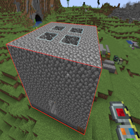

---
navigation:
  title: "Cut Paste Gadget"
  icon: "buildinggadgets2:gadget_cut_paste[buildinggadgets2:forge_energy=5000000]"
  position: 4
  parent: buildinggadgets2:gadgets.md
---

# Cut Paste Gadget

The cut paste gadget makes moving structures a breeze, and works just like the [Copy Paste Gadget](./copypaste.md)! To start, ensure you're in 'cut' mode in the settings menu. 

Right click one corner of a structure,and then shift-right click an opposing corner.  If done correctly, a red outline will surround your structure.

## Cutting

Cutting a structure

TODO: Unsupported flag 'border'

The structure will not be removed until you click the 'cut' button in the settings menu. 

Switch the gadget to 'paste' mode, and you'll see a ghostly preview of the structure you've copied. 

To place the structure in world, simply right click! No items are necessary for this, as its using the blocks you removed earlier.

## Paste Preview

Previewing a paste

TODO: Unsupported flag 'border'

You can only have one structure stored on the gadget at a time. Placing it in the world will erased the stored information on the gadget.

Be careful when pasting the structure, you only get one chance, [exchange mode](./exchangemode.md) is recommended! 

If you attempt to cut a new area while data already exists, you'll be prompted to confirm. If you do this, the first set of data will be lost forever!

All block-entity data will be moved along with the structure, including the contents of chests and block configurations. 

Much like the [Copy Paste Gadget](./copypaste.md), you can modify the cut or paste positions with the appropriate settings menu option. See that chapter for details!

