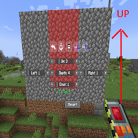
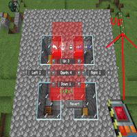

---
navigation:
  title: "Destruction Gadget"
  icon: "buildinggadgets2:gadget_destruction[buildinggadgets2:forge_energy=2000000]"
  position: 5
  parent: buildinggadgets2:gadgets.md
---

# Destruction Gadget

The destruction gadget makes clearing a large area very easy. Any blocks cleared will be **voided!**.

First, open the settings menu and adjust the area. This area is with respect to the block (and block face) you are looking at.

If you look at the top face of a block, 'up' will be relative to the player's screen.

## Destruction Gadget

Destroying an area, click the arrow to see diffent pictures!

TODO: Unsupported flag 'border'

Once you're satisfied with the settings, right click on a block to void all the highlighted blocks. They will be removed from the world. 

You may undo this action if you make a mistake. It will not remove items from your inventory to undo, as the gadget is just returning the voided blocks to the world.

