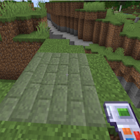

---
navigation:
  title: "Exchanging Gadget"
  icon: "buildinggadgets2:gadget_exchanging[buildinggadgets2:forge_energy=500000]"
  position: 2
  parent: buildinggadgets2:gadgets.md
---

# Exchanging Gadget

The exchanging gadget can swap one set of blocks for another! It cannot, however, replace air blocks. Use a [Building Gadget](./buildinggadget.md) for that! 

First, ensure the gadget has some energy. 

Second, Shift right-click a block in the world to specify the block to exchange to.

You can choose your [Exchanging Mode](./modes.md) by holding the settings key. Each mode is described in its appropriate entry in this book. The default mode is [Surface](./mode_surface.md). 

When looking at a block in the world, you'll see a ghostly image of the blocks that will be placed over top of existing blocks.  If you're missing the required items or energy to place these blocks, they will have a red overlay. Right click to exchange the blocks as shown.

## Exchange Preview

Seeing a preview of what will be exchanged

TODO: Unsupported flag 'border'

When you right click, exchanging will begin. Items will be taken out of your inventory to be placed into the world, and any blocks you don't have the necessary item for will be skipped. 

Items for the removed blocks will be returned to you. 

Note: You can enchant this tool with silk touch. Without it grass will return dirt, etc.

You can [undo](./undo.md) with the exchanging gadget, but you must have the necessary items.

For example, if you exchanged grass into stone bricks, you must have grass in your inventory to undo this exchange. Don't forget to apply silk touch if desired!

