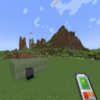

---
navigation:
  title: "Anchor"
  icon: "buildinggadgets2:textures/book/icons/anchor.png"
  position: 1
  parent: buildinggadgets2:mechanics.md
---

# Anchor

Anchor allows you to 'lock in' the block you're looking at, so you can freely move or look around. There is a hotkey for this, or you can access it from the settings menu. 

You can right click at any time to build the structure when it is anchored.

Note: Changing range may not take effect until you remove and replace the anchor.

## Anchor

Anchor your render!

TODO: Unsupported flag 'border'

