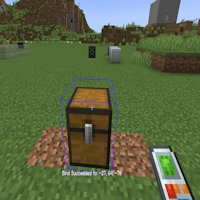
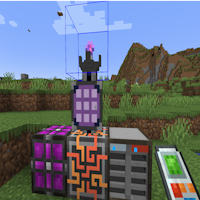

---
navigation:
  title: "Bind Inventory"
  icon: "buildinggadgets2:textures/book/icons/bind_inventory.png"
  position: 1
  parent: buildinggadgets2:mechanics.md
---

# Bind Inventory

Binding to an inventory allows you to interact with that inventory to extract/insert items.  First, enable 'bind inventory' mode in the settings menu of your gadget. Then shift-right click on a chest or other inventory. 

A blue box around the inventory will note your success. Shift-Right click a non inventory block (like grass) to disconnect.

## Bind Inventory

Binding to a Chest!

TODO: Unsupported flag 'border'

You can also bind to an Applied Energistics 2 System by connecting to the wireless access point of that system.  

The gadget will have unlimited range, so no need to worry about range upgrades!

## Bind Inventory

Binding to AE2!

TODO: Unsupported flag 'border'

