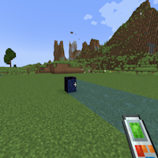
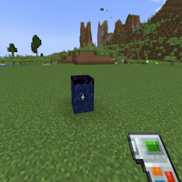
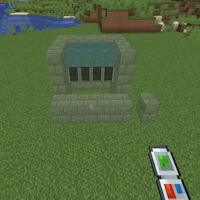

---
navigation:
  title: "Fluid Handling"
  icon: "minecraft:water_bucket"
  position: 1
  parent: buildinggadgets2:mechanics.md
---

# Fluid Handling

Gadgets can interact with Fluids! Make sure [Raytracing Fluids](./mech_raytrace_fluids.md) is enabled to select a fluid with shift-rightclick. 

To place fluids in the world, you'll need a bucket with the appropriate fluid in it. 

Alternatively, mods that add tanks (like Mekanism) can be used, and the fluids will be removed/inserted into tanks.

## Fluid Handling

Switch the images above to see the different options

TODO: Unsupported flag 'border'

The copy paste gadget, can of course, handle fluids as well!

When undoing or exchanging fluids, the gadget will try to find a place to put the fluid (Like an empty bucket or tank) but will void the fluid if one is not found.

## Fluid Handling

Copy Paste Fluids

TODO: Unsupported flag 'border'

