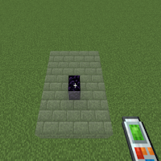
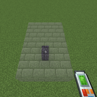

---
navigation:
  title: "Place on Top"
  icon: "buildinggadgets2:textures/book/icons/place_on_top.png"
  position: 1
  parent: buildinggadgets2:mechanics.md
---

# Place on Top

Place on top works a little differently for each mode, and for some modes it won't have any affect at all.

In general, instead of placing around a block, it will place on top of it. Try it out and see what it does to the render!

Look at the two pictures on the right for an example.

## Place on Top

Switch the images above to see the different options

TODO: Unsupported flag 'border'

