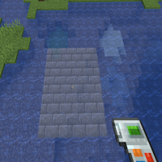

---
navigation:
  title: "Raytrace Fluids"
  icon: "buildinggadgets2:textures/book/icons/raytrace_fluid.png"
  position: 1
  parent: buildinggadgets2:mechanics.md
---

# Raytrace Fluids

Raytrace Fluids allows the gadget(s) to interact with fluids. When turned on, exchangers can swap out fluids, and builders can build on top of fluids. 

When turned off, these gadgets will ignore fluids, and build on the blocks behind them.

See the chapter on [Fluid Handling](./mech_fluid_handling.md) for more details.

## Raytrace Fluids

Affecting Fluids!

TODO: Unsupported flag 'border'

