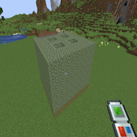

---
navigation:
  title: "Rotate"
  icon: "buildinggadgets2:textures/book/icons/rotate.png"
  position: 1
  parent: buildinggadgets2:mechanics.md
---

# Rotate

Rotate will allow the player to rotate a Copy Paste or Cut Paste around the starting point.

Try it out, and watch what the render does to get a better understanding, or cycle through the pictures on the right.

## Rotate

Rotating a house!

TODO: Unsupported flag 'border'

