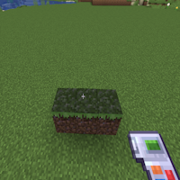
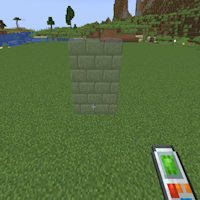

---
navigation:
  title: "Basics"
  icon: "buildinggadgets2:template"
  parent: buildinggadgets2:modes.md
---

# Basics

The building and exchanging gadgets both have a 'range' setting, that specifies the range of blocks affected. Each mode has a slightly different take on this, but in general this represents an area.

For example, in Horizontal Row mode a range of 3 will be 3 blocks total, 1 on each side of the block you're looking at. This is rounded if you choose an even number.

## Range of 3

A range of 3

TODO: Unsupported flag 'border'

For walls, a range of 3 will build a 3x3 wall. Even numbers modify the height of the wall slightly. 

 Experiment with the preview to get the outcome you are looking for!

## Range of 3

A range of 3

TODO: Unsupported flag 'border'

