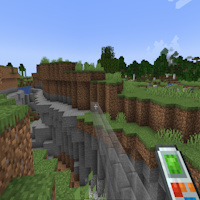

---
navigation:
  title: "Build To Me"
  icon: "buildinggadgets2:textures/book/mode/build_to_me.png"
  position: 1
  parent: buildinggadgets2:modes.md
---

# Build To Me

Build to me mode will build a row of blocks from the blockface you're looking at to the player. This can be horizontal or vertical, depending on the blockface you're looking at.

The range setting is ignored in this mode.

Toggling 'place on top' will build to the player's head rather than feet.

## Build to Me

Building to the player

TODO: Unsupported flag 'border'

