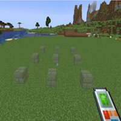
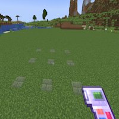

---
navigation:
  title: "Grid"
  icon: "buildinggadgets2:textures/book/mode/grid.png"
  position: 1
  parent: buildinggadgets2:modes.md
---

# Grid

Grid mode places blocks in a grid! Useful for torches, glowstone, etc. As the range increases the blocks get further apart from each other, until eventually the area just gets larger. 

This is also an exchanger mode that lets you swap blocks in a grid.

## Grid Mode

Switch the images above to see the different options

TODO: Unsupported flag 'border'

