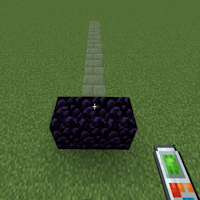
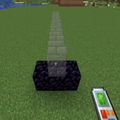
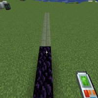

---
navigation:
  title: "Horizontal Row"
  icon: "buildinggadgets2:textures/book/mode/horizontal_row.png"
  position: 1
  parent: buildinggadgets2:modes.md
---

# Horizontal Row

Horizontal Row will build blocks away from the player based on the direction they are looking. This is useful for building bridges! 

Toggle 'place on top' to see how it changes the placement. 

This is also available on the exchanger, to exchange 'left and right' of the direction the player is looking.

## Horizontal Row

Switch the images above to see the different options

TODO: Unsupported flag 'border'

