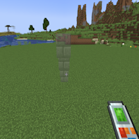

---
navigation:
  title: "Stairs"
  icon: "buildinggadgets2:textures/book/mode/stairs.png"
  position: 1
  parent: buildinggadgets2:modes.md
---

# Stairs

Stairs will either build up and away from you, or up and towards you, depending on whether you're above or below the block you're looking at.

Honestly its pretty derpy and confusing and could use a rewrite.

## Stairs

Switch the images above to see the different options

TODO: Unsupported flag 'border'

