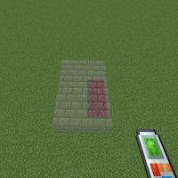

---
navigation:
  title: "Surface"
  icon: "buildinggadgets2:textures/book/mode/surface.png"
  position: 1
  parent: buildinggadgets2:modes.md
---

# Surface

Surface mode will extend a set of blocks you're looking at. See the images on the right for an example.

Fuzzy mode will allow the gadget to target any blocks, or only the same blocks as the one you're looking at.

## Surface Fuzzy

Switch the images above to see the different options

TODO: Unsupported flag 'border'

This mode is also available for the exchanger, and fuzzy mode works the same. 

In addition, connected mode will only exchange blocks that are connected to the ones you're looking at. See the images to the right for an explanation.

## Surface Connected

Switch the images above to see the different options

TODO: Unsupported flag 'border'

