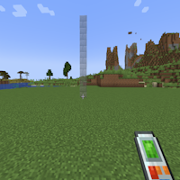
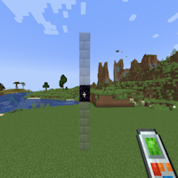
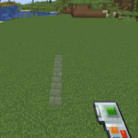

---
navigation:
  title: "Vertical Column"
  icon: "buildinggadgets2:textures/book/mode/vertical_column.png"
  position: 1
  parent: buildinggadgets2:modes.md
---

# Vertical Column

Vertical Column mode is available for both the building and exchanging gadgets.

It will build up or down if you're looking at the top or bottom of a block, or build both up and down around if looking at the side of a block.

## Vertical Column

Switch the images above to see the different options

TODO: Unsupported flag 'border'

