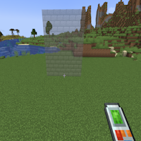
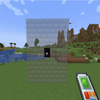
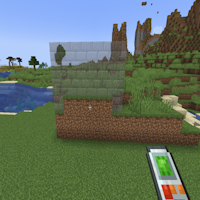

---
navigation:
  title: "Vertical Wall"
  icon: "buildinggadgets2:textures/book/mode/vertical_wall.png"
  position: 1
  parent: buildinggadgets2:modes.md
---

# Vertical Wall

Vertical wall will build a wall upwards or downwards from the top or bottom of a block you're looking at. 

If looking at the side of a block, it'll build around it.

## Vertical Wall

Switch the images above to see the different options

TODO: Unsupported flag 'border'

