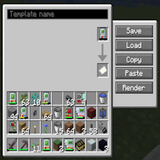
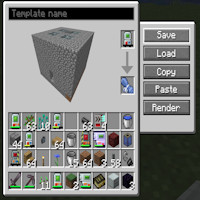
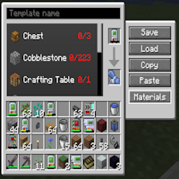
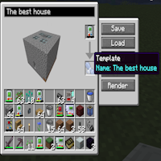

---
navigation:
  title: "Template Manager"
  icon: "buildinggadgets2:template_manager"
  position: 1
  parent: buildinggadgets2:templates.md
---

# Template Manager

The template manager allows you to save your favorite structures from the [Copy Paste Gadget](./copypaste.md)!  

With this block, you can save the structures to items in your world, or even share them outside your world!

To get started, place a copy paste gadget in the top slot, and a piece of paper in the bottom.

## Template Manager

Step 1

TODO: Unsupported flag 'border'

Click 'Save' to convert the paper into a template. At the same time, a render of the structure will appear on your screen.

You can pan and spin the render with the mouse buttons, or zoom with the scroll wheel. 

To copy the structure from a template back to the gadget, click the 'load' button.

## Bind Inventory

Fancy render is fancy

TODO: Unsupported flag 'border'

Click the 'Render' button to toggle it to Materials Mode, which will show a list of the needed materials for this structure, in much the same way the Material List does.

Click the materials button to toggle back to Render mode.

## Material List

So many items

TODO: Unsupported flag 'border'

Templates can be named. The name will appear on the template item.

Clicking 'copy' will create a json string and put it on your computers clipboard. You can share this will friends outside of minecraft. If they copy the same string to their clipboard and click the 'paste' button in this GUI it'll replicate your structure for them!

Make sure theres paper in the bottom slot when you click paste.

## Naming

It really is a nice house though.

TODO: Unsupported flag 'border'

