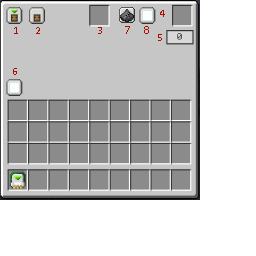
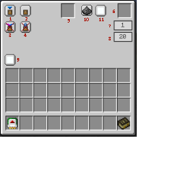

---
navigation:
  title: "Basics"
  icon: "laserio:logic_chip"
  parent: laserio:mechanics.md
---

# Basics

Right clicking a Card in your hand will open up it's UI. You can also right click a card inside a [Node](./laser_node.md) UI.

Insert Mode:
1. [Mode](./modes.md)
2. [Sneaky](./sneaky.md)
3. Filter
4. [Card Overclocker](./overclocker_card.md)
5. [Priority](./priority.md)
6. [Channel](./channel.md)
7. [Redstone Mode](./redstonemode.md)
8. [Redstone Channel](./redstonechannel.md)

## Insert UI

An item card set to Insert Mode

TODO: Unsupported flag 'border'

Extract Mode:

1. [Mode](./modes.md)
2. [Sneaky](./sneaky.md)
3. [Round Robin](./roundrobin.md)
4. [Exact](./exact.md)
5. Filter
6. [Card Overclocker](./overclocker_card.md)
7. [Extract Amount](./extractamount.md)
8. [Tick Speed](./tickspeed.md)
9. [Channel](./channel.md)

## Extract UI

An item card set to Extract Mode.

TODO: Unsupported flag 'border'

Stock Mode:

1. [Mode](./modes.md)
2. [Sneaky](./sneaky.md)
3. [Regulate](./regulate.md)
4. [Exact](./exact.md)
5. Filter
6. [Card Overclocker](./overclocker_card.md)
7. [Extract Amount](./extractamount.md)
8. [Tick Speed](./tickspeed.md)
9. [Channel](./channel.md)

## Stock UI

An item card set to Stock Mode.

TODO: Unsupported flag 'border'

