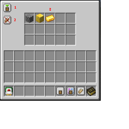

---
navigation:
  title: "Basic Mechanics"
  icon: "laserio:logic_chip"
  parent: laserio:filters.md
---

# Basic Mechanics

Right click a filter item to open it's UI. Alternatively, the UI is also available when filters are inside cards.

Filters allow you to restrict what items can be inserted, extracted, or stocked.

1. Allow vs Deny
2. Compare NBT
3. Filter Slots

## Filter UI

Basic Filter UI

TODO: Unsupported flag 'border'

Allow vs Deny

In allow mode, the items in the filter will be allowed by the filter. Meaning that inserters can accept cobblestone, or extractors can extract cobblestone.

In Deny mode, it is the opposite.

Compare NBT

When compare NBT is enabled, NBT tags on items will be considered by the filter. For example, a sword stores how much damage it has taken on NBT. With 'Compare NBT' enabled, a diamond sword without any damage is different than a damaged one, or an enchanted one.

With Compare NBT disabled, all diamond swords will match, regardless of their status. 

