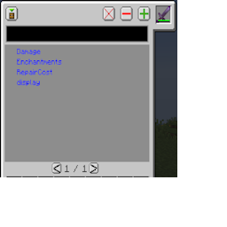

---
navigation:
  title: "NBT Filter"
  icon: "laserio:filter_nbt"
  position: 3
  parent: laserio:filters.md
---

# NBT Filter

The NBT filter has a very similar UI and functionality as the [Tag Filter](./filter_tag.md).

Placing an item in the top right slot will show you all nbt tag labels on that item. Adding them to the list (in the same way you do with the tag filter) will filter items that contain those tags, regardless of the values those tags are assigned.

## NBT UI

NBT UI

TODO: Unsupported flag 'border'

For example, all enchanted items have an 'Enchantments' tag, which specifies things like Looting, sharpness, etc. If you add the 'enchantments' tag to this list, the filter will filter out all enchanted items.

Enchanted swords can go in one inventory, and non-enchanted to another. Regardless of which enchantments are applied.

All other functionality is identical to the [Tag Filter](./filter_tag.md), see that entry for more information.

