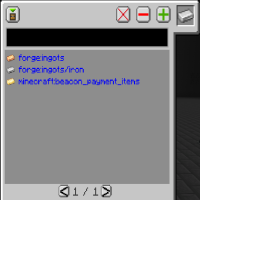

---
navigation:
  title: "Tag Filter"
  icon: "laserio:filter_tag"
  position: 2
  parent: laserio:filters.md
---

# Tag Filter

The tag filter allows a player to filter by tags on resources.

Tags are a way for Minecraft to group similar resources. For example, on the right we can see that an Iron Ingot has the 'forge:ingots' tag. So too does gold, copper, tin, etc.

The tag filter would allow you to sort on all ingots with a single entry!

## Tag UI

Tag UI

TODO: Unsupported flag 'border'

First, start by placing an item in the slot on the top right. A list of tags on this item will appear in <Color hex="#0000ff">blue</Color>. Click on the tag you want added, and press the + button. Holding shift and pressing the + button will add all tags to the list.

To remove a tag from the list, select it and press the - button. 

Alternatively you can shift-click to automatically add/remove the tag.

The X button will clear the entire list.

The list is treated as an 'or' list - meaning an item that matches any one of the tags on the list will be filtered.

Tag Filters do not support NBT comparisons, as that would not make any sense.

