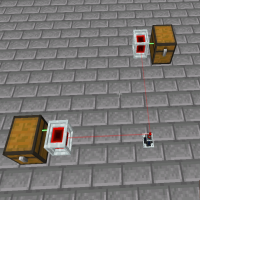

---
navigation:
  title: "Laser Connector"
  icon: "laserio:laser_connector"
  position: 1
  parent: laserio:blocks.md
item_ids:
  - laserio:laser_connector
---

# Laser Connector

Multiple [Laser Nodes](./laser_node.md) can be connected directly to each other using the [Laser Wrench](./laser_wrench.md), however the maximum range is 8 blocks. 

Laser Connectors can act as a cheaper intermediary point between nodes, allowing you to build a network of interconnected inventories.

## Laser Node

Connector between 2 nodes

TODO: Unsupported flag 'border'

## Laser Connector

<Recipe id="laserio:laser_connector" />

