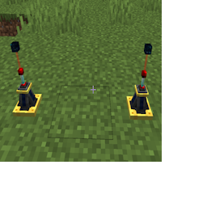
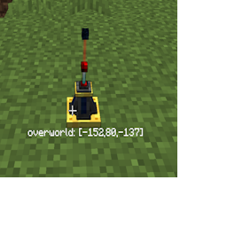

---
navigation:
  title: "Adv. Connector"
  icon: "laserio:laser_connector_advanced"
  position: 2
  parent: laserio:blocks.md
item_ids:
  - laserio:laser_connector_advanced
---

# Adv. Connector

Advanced Laser Connectors work just like [Laser Connectors](./laser_connector.md), connecting to other (basic) connectors and nodes up to 8 blocks away. 

They can only be connected to one other Advanced Connector, however, forming a pair.  The connection range from one advanced connector to its partner is infinite - including across dimensions!

## Adv. Connector

Two Advanced Connectors linked to each other

TODO: Unsupported flag 'border'

If an Advanced Connector already has a partner, and you attempt to pair it with a new partner, the original connection will be broken to form the new connection.  

When looking at the block with the [Laser Wrench](./laser_wrench.md) in your hand, you'll see the coordindates of the partner block.

## Partner Coordindates

Showing the coordinates of the partner connector

TODO: Unsupported flag 'border'

Advanced Laser Connectors do NOT chunk load for you. You are responsible for handling all chunk loading on your own! Nodes in unloaded chunks will not operate.

## Adv. Laser Connector

<Recipe id="laserio:laser_connector_advanced" />

