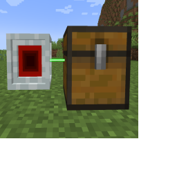
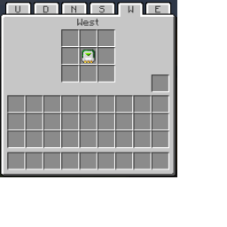
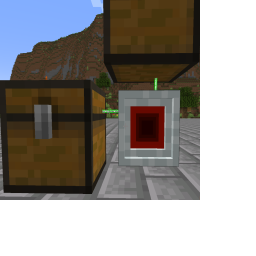
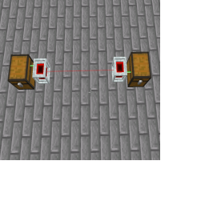

---
navigation:
  title: "Laser Node"
  icon: "laserio:laser_node"
  parent: laserio:blocks.md
item_ids:
  - laserio:laser_node
---

# Laser Node

The Laser Node is the most important block in LaserIO as it allows interaction with adjacent blocks. 

By using Cards such as the [Item Card](./card_item.md), you can interact with the adjacent block to transfer Items, Fluids, Energy, or Redstone.

## Laser Node

Node interacting with Chest

TODO: Unsupported flag 'border'

Each side of a node has a 3x3 grid of inventory slots that accept Cards. Right click a node's side to open it's UI. 

Use the buttons along the top to change which side you're working on, in case the side you want to modify isn't easily accessible.

The adjacent screenshot shows a node interacting with an inventory on it's west side. 

## Laser Node UI

Node UI with Card

TODO: Unsupported flag 'border'

Nodes can interact with multiple adjacent inventories at the same time.

## Laser Node Working

Node between 2 chests

TODO: Unsupported flag 'border'

Nodes can be connected together using the [Laser Wrench](./laser_wrench.md), allowing connections between distant inventories.  The maximum range between connections is 8 blocks.

If your nodes are father apart, it is recommended to use [Laser Connectors](./laser_connector.md).

## Laser Nodes Connected

Two Nodes Connected

TODO: Unsupported flag 'border'

## Laser Node

<Recipe id="laserio:laser_node" />

