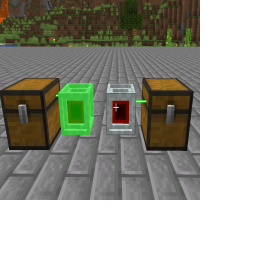

---
navigation:
  title: "Laser Wrench"
  icon: "laserio:laser_wrench"
  position: 1
  parent: laserio:items.md
item_ids:
  - laserio:laser_wrench
---

# Laser Wrench

The Laser Wrench is primarily used to connect multiple Blocks together.

[Nodes](./laser_node.md) and [Connectors](./laser_connector.md) can be connected by Shift-RightClicking to select a block, and then right clicking another block to form a connecion.

The max connection range is 8 blocks.

## Laser Wrench

The currently selected block is highlighted green.

TODO: Unsupported flag 'border'

## Laser Wrench

<Recipe id="laserio:laser_wrench" />

