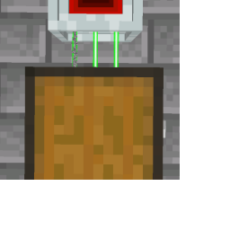
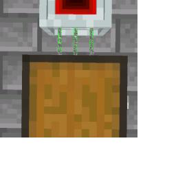

---
navigation:
  title: "Node Overclocker"
  icon: "laserio:overclocker_node"
  position: 3
  parent: laserio:items.md
item_ids:
  - laserio:overclocker_node
---

# Node Overclocker

Node Overclockers are a more complex component.

Each [Node](./laser_node.md) can only operate on 1 card per side per tick. 

If there are 3 extractor cards in the side of a node, only the first one will operate during a game tick, and the second will only operate if the first fails to do anything.

## No Node Overclockers

There are zero Node Overclockers installed

TODO: Unsupported flag 'border'

Each Node Overclocker installed on the side of a Node allows that side to operate on more cards per tick. A total of 8 Node Overclockers can be installed, allowing all 9 nodes to be operated on. 

Inserter cards do **<Color hex="#ff0000">NOT</Color>** need overclockers to function, **ONLY** Extractor and Stocker cards need them.

## 2 Node Overclockers

There are two Node Overclockers installed

TODO: Unsupported flag 'border'

## Node Overclocker

<Recipe id="laserio:overclocker_node" />

