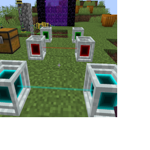

---
navigation:
  title: "Network Settings"
  icon: "laserio:textures/gui/buttons/settings.png"
  position: 1
  parent: laserio:mechanics.md
---

# Network Settings

The network settings screen is available from any [Laser Node](./laser_node.md) screen. In this settings screen, you may change the color of the network. This color will affect:
- Laser Node Block (in world)
- Laser Connector Block (in world)
- Color of lasers between blocks. 

## Colored Nodes

Different Colored networks

TODO: Unsupported flag 'border'

The color of the lasers between the node and inventories (Like chests or tanks) will not be affected.

Making a change to a node on a network will automatically propagate to all other nodes across the same network. In this way, you can have different colored networks around your world!

This is purely cosmetic and has no practical effect on functionality.

When adding a node or network to another network, the following rules apply:

If one of the nodes/networks has a color setting, and the other is default, the default will always be overridden.

Otherwise the highlighted block will send its settings to the on you click on the connect it. For example, if you shift-click a green node and then click on a blue node, the blue node will turn green. 

There are two settings for Alpha, Alpha and Wrench Alpha.

Alpha only affects the laser going between any two blocks and determines the transparency of that laser. If set to 0, you will not see the lasers between nodes/connectors at all.

Wrench Alpha will ADD this setting to the alpha when the player is holding the wrench.

For example, if you set alpha to 0 and wrench alpha to 80, you'll only see the lasers when holding a wrench!

If you set the alpha to 80 and the wrench alpha to 200, you'll see the lasers more brightly while holding the wrench. Theres no harm in going above 255 when adding the two numbers, it will automatically limit itself to 255.

