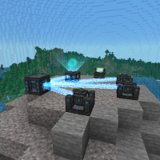

---
navigation:
  title: "Introduction"
  icon: "minecraft:lectern"
  parent: mffs:getting_started.md
---

# Introduction

**Modular Force Field Systems** (or MFFS) is a mod that adds <Color id="dark_aqua">force fields</Color>, <Color id="dark_purple">high tech machinery</Color> and <Color id="gold">defensive measures</Color> to Minecraft. Ever tired of nuclear explosions blowing up your house or want to keep people out of your secret bases? Say no more, **we've got you covered!**

An overview of MFFS Force Field technology

TODO: Unsupported flag 'border'

Force fields can be used for a myriad of things, including: 
- Keeping intruders out of your house
- Building structures
- Creating underwater bases or airlocks
- Exterminating approaching mobs
- Capturing enemies in traps
- Protecting against ballistic missiles
- Confiscating items from players

MFFS also features configuration options that can <Color id="dark_aqua">remove its dependency on electrical energy</Color>, making it usable within vanilla Minecraft or in combination with other mods. MFFS is most commonly used in <Color id="dark_green">multi-player</Color> worlds, but certainly provides many benefits for <Color id="dark_green">single-player</Color> as well.

