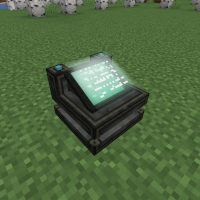

---
navigation:
  title: "Biometric Identifier"
  icon: "mffs:biometric_identifier"
  parent: mffs:machines.md
item_ids:
  - mffs:biometric_identifier
---

# Biometric Identifier

<ItemImage id="mffs:biometric_identifier" />

The <Color id="blue">Biometric Identifier</Color> is a member of the MFFS family of machines. It uses bio-signatures given off by players to govern what permissions they have when interacting with force fields and MFFS machines. For example, it can allow a player to pass through an active force field, or exempt them from the effects of the [Interdiction Matrix](./interdiction_matrix.md).

Crafting the <Color id="blue">Biometric Identifier</Color>.

<Recipe id="mffs:biometric_identifier" />

## Usage

To configure the <Color id="blue">Biometric Identifier</Color> to recognise a player, open its GUI screen and place an [Identification Card](../tools/id_card.md) into the top-left item slot labeled <Color id="dark_green">Rights</Color>. If the Identification Card is blank and hasn't already been assigned, you can either shift-right-click while holding it in your hand to assign it to yourself, or shift-right-click another player to assign it to them.

Next, set which permissions you wish the player to have by toggling the buttons on the right side of the GUI. Each button assigns the following permission:
- **Warp**: Permit the player to bypass force fields by sneaking through them.
- **Block Alter**: Allow the player to place or break blocks while standing inside the area protected by the [Interdiction Matrix](./interdiction_matrix.md).

- **Block Access**: Let the player open the GUI screen of anything while standing inside the Matrix's operational range.
- **Configure**: Grant the player access to configure the Biometric Identifier and change user permissions.
- **Bypass Defense**: Allow the player to bypass restrictions enforced by the [Interdiction Matrix](./interdiction_matrix.md).
- **Bypass Confiscation**: Exempt the player from the confiscation effect of the Interdiction Matrix.

- **Remote Control**: Permit the player to use a remote control on machines linked to the Identifier.

With the player's rights now assigned, move their card into any of the 9 slots along the bottom of the GUI screen to complete the process. To set yourself as the master of a <Color id="blue">Biometric Identifier</Color>, place an [Identification Card](../tools/id_card.md) assigned to you into the item slot labeled <Color id="dark_green">Master</Color>.

The master user of a <Color id="blue">Biometric Identifier</Color> is <Color id="dark_red">automatically granted all permissions.</Color> Enable the <Color id="blue">Biometric Identifier</Color> by applying a Redstone signal or by clicking the Redstone Torch button in the top-left corner of its GUI. Once activated, the <Color id="blue">Biometric Identifier</Color> will light up and take effect.

## Display

An active <Color id="blue">Biometric Identifier</Color>.

TODO: Unsupported flag 'border'

## Notes

- While warping through a force field, a player must keep sneaking until they have fully exited the field barrier, otherwise they'll be killed.
- [Identification Card](../tools/id_card.md)s can't be removed from the Identifier while it's active.
- Passing through a force field can cause temporary Nausea IV.
- A player in creative mode can always warp through a force field.

