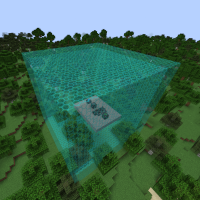

---
navigation:
  title: "Cube Mode"
  icon: "mffs:cube_mode"
  parent: mffs:projector_modes.md
item_ids:
  - mffs:cube_mode
---

# Cube Mode

<ItemImage id="mffs:cube_mode" />

By default, the <Color id="dark_green">Cube Mode</Color> sets the Projector to generate a force field in the shape of a cube that is exactly 1 block thick. Each [<Color id="dark_purple">Scale Module</Color>](../scale_module.md) increases the size of the force field by 1 block in all directions.

Crafting the <Color id="dark_green">Cube Mode</Color>.

<Recipe id="mffs:cube_mode" />

## Field Adjustment

The <Color id="dark_green">Cube Mode</Color> item can also be used to create cuboid (or right rectangular prism) shape force fields. Placing a [<Color id="dark_purple">Scale Module</Color>](../scale_module.md) into an item slot marked by a directional arrow will scale the field by 1 block in only that direction. For example, to increase the height of a force field by 1 block; add a [<Color id="dark_purple">Scale Module</Color>](../scale_module.md) into an item slot marked by a directional arrow pointing towards the top-left or top-right of the GUI screen.

## Projection

A scaled <Color id="dark_green">Cube Mode</Color> field being projected.

TODO: Unsupported flag 'border'

