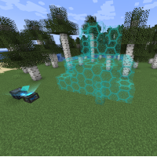
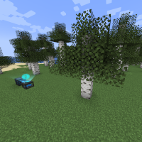

---
navigation:
  title: "Custom Mode"
  icon: "mffs:custom_mode"
  parent: mffs:projector_modes.md
item_ids:
  - mffs:custom_mode
---

# Custom Mode

<ItemImage id="mffs:custom_mode" />

The <Color id="dark_green">Custom Mode</Color> is the most versatile of all the modes, as it allows a force field of any shape or structure to be projected. Once a user-defined block pattern has been analysed and stored by the <Color id="dark_green">Custom Mode</Color> item itself, the Projector is able to generate a force field that is an <Color id="blue">exact replica</Color> of the original. In this manner, force fields may be constructed in the shape of <Color id="blue">anything that can be crafted</Color> - including a bridge, a house, or even an entire fortress!

Crafting the <Color id="dark_green">Custom Mode</Color>.

<Recipe id="mffs:custom_mode" />

## Usage

Hold the <Color id="dark_green">Custom Mode</Color> item and use it on two blocks in the world. These two (primary and secondary) blocks will define a 3D space that the <Color id="dark_green">Custom Mode</Color> can analyse. As each block is clicked on, their coordinates in the world will be stored as 'Primary pos' and 'Secondary pos'. Use while sneaking to instruct the <Color id="dark_green">Custom Mode</Color> item to analyze and save all the blocks that exist between the selected points.

When the Projector detects that a <Color id="dark_green">Custom Mode</Color> item has been entered into the correct slot, random holograms will continuously appear above it to indicate that the field pattern does not match any of the known mode shapes (this is a feature, not a bug). If desired, set where the force field should appear (in relation to the Projector) by adding [<Color id="dark_purple">Translation Modules</Color>](../translation_module.md) into the item slots marked by directional arrows.

## Field Adjustment

As with the other projector modes, <Color id="dark_green">Custom Mode</Color> force fields can be rotated and scaled using the [<Color id="dark_purple">Rotation</Color>](../rotation_module.md) and [<Color id="dark_purple">Scale Modules</Color>](../scale_module.md) respectively.

## Projection

A <Color id="dark_green">Custom Mode</Color> field being projected.

TODO: Unsupported flag 'border'

## Projection

A <Color id="dark_green">Custom Mode</Color> field being projected with a [<Color id="dark_purple">Camouflage Module</Color>](../camouflage_module.md) applied.

TODO: Unsupported flag 'border'

