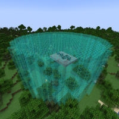

---
navigation:
  title: "Cylinder Mode"
  icon: "mffs:cylinder_mode"
  parent: mffs:projector_modes.md
item_ids:
  - mffs:cylinder_mode
---

# Cylinder Mode

<ItemImage id="mffs:cylinder_mode" />

By default, the <Color id="dark_green">Cylinder Mode</Color> sets the Projector to generate a force field in the shape of a cylinder that is exactly 1 block thick. Each [<Color id="dark_purple">Scale Module</Color>](../upgrade_modules/scale_module.md) increases the size of the force field by 1 block in the target direction.

Crafting the <Color id="dark_green">Cylinder Mode</Color>.

<Recipe id="mffs:cylinder_mode" />

## Field Adjustment

Placing a [<Color id="dark_purple">Scale Module</Color>](../upgrade_modules/scale_module.md) into an item slot marked by a directional arrow will scale the field by 1 block in only that direction. For example, to increase the height of a force field by 1 block; add a [<Color id="dark_purple">Scale Module</Color>](../upgrade_modules/scale_module.md) into an item slot marked by a directional arrow pointing towards the top-left or top-right of the GUI screen.

## Projection

A scaled <Color id="dark_green">Cylinder Mode</Color> field being projected.

TODO: Unsupported flag 'border'

