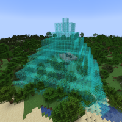

---
navigation:
  title: "Pyramid Mode"
  icon: "mffs:pyramid_mode"
  parent: mffs:projector_modes.md
item_ids:
  - mffs:pyramid_mode
---

# Pyramid Mode

<ItemImage id="mffs:pyramid_mode" />

By default, the <Color id="dark_green">Pyramid Mode</Color> sets the Projector to generate a force field in a pyramid-like shape. The thickness of the pyramid-like shape depends on its size. Each [<Color id="dark_purple">Scale Module</Color>](../scale_module.md) increases the size of the field by 1 block in all directions.

Crafting the <Color id="dark_green">Pyramid Mode</Color>.

<Recipe id="mffs:pyramid_mode" />

## Field Adjustment

Placing a [<Color id="dark_purple">Scale Module</Color>](../scale_module.md) into an item slot marked by a directional arrow has a different effect. A module placed in either the left, right, front or back item slots will scale the field by 1 block in both opposing directions at the same time. Placing a module in either the up or down item slots will scale the field by 1 block only in that direction.

For example, to increase the height of a force field by 1 block; add a [<Color id="dark_purple">Scale Module</Color>](../scale_module.md) into an item slot marked by a directional arrow pointing towards the top-left or top-right of the GUI screen.

## Projection

A scaled <Color id="dark_green">Pyramid Mode</Color> field being projected.

TODO: Unsupported flag 'border'

