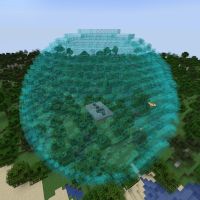

---
navigation:
  title: "Sphere Mode"
  icon: "mffs:sphere_mode"
  parent: mffs:projector_modes.md
item_ids:
  - mffs:sphere_mode
---

# Sphere Mode

<ItemImage id="mffs:sphere_mode" />

By default, the <Color id="dark_green">Sphere Mode</Color> sets the Projector to generate a force field in the shape of a sphere that is exactly 1 block thick. Each [<Color id="dark_purple">Scale Module</Color>](../scale_module.md) increases the size of the force field by 1 block.

Crafting the <Color id="dark_green">Sphere Mode</Color>.

<Recipe id="mffs:sphere_mode" />

## Field Adjustment

Adding [<Color id="dark_purple">Scale Module</Color>](../scale_module.md)s to item slots marked with a directional arrow further increases the radius of the force field by 1 block per module.

## Projection

A scaled <Color id="dark_green">Sphere Mode</Color> field being projected.

TODO: Unsupported flag 'border'

