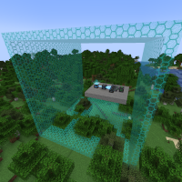

---
navigation:
  title: "Tube Mode"
  icon: "mffs:tube_mode"
  parent: mffs:projector_modes.md
item_ids:
  - mffs:tube_mode
---

# Tube Mode

<ItemImage id="mffs:tube_mode" />

By default, the <Color id="dark_green">Tube Mode</Color> sets the Projector to generate a force field in the shape of a square tube (or tetragonal prism) that is exactly 1 block thick. A tube shaped field consists of four solid sides that run parallel along the horizontal plane. The front and back sides of the Projector represent the open faces of the force field tube.

Crafting the <Color id="dark_green">Tube Mode</Color>.

<Recipe id="mffs:tube_mode" />

## Field Adjustment

Placing a [<Color id="dark_purple">Scale Module</Color>](../scale_module.md) into an item slot marked by a directional arrow will scale the field by 1 block in only that direction. For example, to increase the height of a force field by 1 block; add a [<Color id="dark_purple">Scale Module</Color>](../scale_module.md) into an item slot marked by a directional arrow pointing towards the top-left or top-right of the GUI screen.

## Projection

A scaled <Color id="dark_green">Tube Mode</Color> field being projected.

TODO: Unsupported flag 'border'

