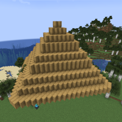

---
navigation:
  title: "Camouflage Module"
  icon: "mffs:camouflage_module"
  parent: mffs:projector_modules.md
item_ids:
  - mffs:camouflage_module
---

# Camouflage Module

<ItemImage id="mffs:camouflage_module" />

The <Color id="dark_purple">Camouflage Module</Color> can be used in a [Force Field Projector](../projector.md) to alter the appearance of the force field itself. With a <Color id="dark_purple">Camouflage Module</Color> installed, force fields may be disguised as regular blocks. For example, a force field might be masked as a wall of Stone. The <Color id="dark_purple">Camouflage Module</Color> can be used in combination with all Projector Modes.

Crafting the <Color id="dark_purple">Camouflage Module</Color>.

<Recipe id="mffs:camouflage_module" />

## Usage

This feature of the Projector can help players to hide things from other people or camouflage the entrance to a secret base. Select a block you wish to use as camouflage and place it in another empty slot of the Projector's left-hand item matrix (the same matrix as the <Color id="dark_purple">Camouflage Module</Color>). Activate the Projector in the usual way.

## Projection

A Pyramid force field camouflaged as Stripped Oak Wood.

TODO: Unsupported flag 'border'

