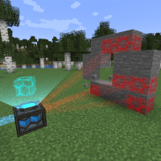

---
navigation:
  title: "Disintegration Module"
  icon: "mffs:disintegration_module"
  parent: mffs:projector_modules.md
item_ids:
  - mffs:disintegration_module
---

# Disintegration Module

<ItemImage id="mffs:disintegration_module" />

The <Color id="dark_purple">Disintegration Module</Color> can be used in a [Force Field Projector](../machines/projector.md) to alter the effect a force field has on its surroundings. Placing a <Color id="dark_purple">Disintegration Module</Color> into a Projector's matrix slots will cause the field it generates to break any blocks that are obstructing it. Broken blocks are dropped as items and can be picked up.

Crafting the <Color id="dark_purple">Disintegration Module</Color>.

<Recipe id="mffs:disintegration_module" />

## Usage

The <Color id="dark_purple">Disintegration Module</Color> is compatible with all projector modes and can be used to reverse the effect of the [<Color id="dark_purple">Field Stabilizer Module</Color>](./stabilization_module.md). Adding [<Color id="dark_purple">Speed Module</Color>](../upgrade_modules/speed_module.md)s into a Projector allows multiple blocks to be disintegrated at once. It can also be combined with a [<Color id="dark_purple">Collection Module</Color>](./collection_module.md) to automatically pick up broken blocks.

## Projection

A Force Field Projector destroying a wall using the <Color id="dark_purple">Disintegration Module</Color>.

TODO: Unsupported flag 'border'

