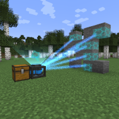

---
navigation:
  title: "Stabilization Module"
  icon: "mffs:stabilization_module"
  parent: mffs:projector_modules.md
item_ids:
  - mffs:stabilization_module
---

# Stabilization Module

<ItemImage id="mffs:stabilization_module" />

The <Color id="dark_purple">Stabilization Module</Color> may be used in a [Force Field Projector](../projector.md) to crystallise the field into a solid form. Instead of creating an energy field barrier that disappears when it is turned off, the Projector replaces the field with real blocks supplied by the player.

In this manner, the <Color id="dark_purple">Stabilization Module</Color> makes it possible to produce an exact physical replica of a force field pattern that remains after the Projector is deactivated. Because the field is constructed using actual blocks, its durability corresponds to that of the blocks. However, as long as the Projector is sufficiently powered and supplied with enough replacement blocks, it will continually regenerate the field structure if it is broken.

The stabilization (transposition) process requires more [Fortron](../fortron.md) and is slower than normal field projection; but if used in combination with the [<Color id="dark_green">Custom Mode</Color>](../custom_mode.md) feature of a Projector, its conceivable applications are virtually limitless. For example, a player could create a structure that was automatically repaired whenever a <Color id="dark_green">Creeper</Color> tried to blow it up. Adding [<Color id="dark_purple">Speed Module</Color>](../speed_module.md)s into a Projector allows multiple blocks to be stabilized at once.

Crafting the <Color id="dark_purple">Stabilization Module</Color>.

<Recipe id="mffs:stabilization_module" />

## Usage

- Place a chest next to the [Force Field Projector](../projector.md) (any side) and make sure it contains the required blocks to build the field up.
- Insert a Field Stabilization Module into the Projector's matrix slots. Setup the field as your wish and then activate the Projector.
- The Projector will consume blocks from adjacent chests in the order that they appear. If a chest contains a mixture of different blocks, the target structure will also be composed of a block mixture.

## Projection

A Force Field Projector stabilizing a wall using the <Color id="dark_purple">Stabilization Module</Color>.

TODO: Unsupported flag 'border'

## Custom Mode Usage

Unlike the other modes available for the [Force Field Projector](../projector.md), the [<Color id="dark_green">Custom Mode</Color>](../custom_mode.md) item stores the precise position and type of each block it analyses. As a result, the stabilization process for the [<Color id="dark_green">Custom Mode</Color>](../custom_mode.md) does not work in the same way. Instead of consuming blocks in their order of appearance and transposing them to arbitrary locations; the Projector will take only the block types that match the original pattern.

Each block is placed exactly as it should be according to its type and position. If a Projector runs out of the matching block types necessary to replicate a pattern, it will pause until they are provided.

