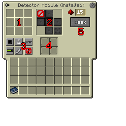

---
navigation:
  title: "Modules"
  icon: "modularrouters:breaker_module"
  parent: modularrouters:intro.md
---

# Modules

*Modules* are inserted into an [Modular Router](./modular_router.md) and tell the router what to do. There are 20 different module types, each of which has a specific function.  All modules have some characteristics in common, however:
- All modules have 9 *filter slots* to control which item(s) a module will process.
- Many modules have a defined *direction*, relative to the router's facing.

- Some modules have extra settings for configuring module-specific functionality.

All this can be configured in the module's GUI, which you can access by *Right-Clicking* the module in hand.

You can also configure an installed module in a router GUI by pressing <Color id="dark_red">**[$(k:modularrouters.configure)]$(/k:modularrouters.configure)**</Color> while hovering over it, or *Middle-Clicking* the module in the GUI, without needing to remove it from the router.

*Module GUI: see following pages for a description of each part of the GUI*

TODO: Unsupported flag 'border'

## 1. Filter Slots

There are nine filter slots, where you can insert ghost copies of any item or block. The module will only operate if the item in the router's *buffer* matches an item in the module's filter (if whitelisting; the opposite if blacklisting).

## 2. Direction Selector

Most modules operate in a defined direction, relative to the router's facing. Here you can define the direction.

Some modules (e.g. the [Sender Mk2](../modules/sender2.md)) target a distant block directly, so do not have a definable direction. In this case, the direction selector will be blank.

## 3. Filter Control

Here there are several buttons which control:
- Whitelisting vs. blacklisting
- Whether to match item damage (for items with durability)
- Whether to match item NBT, e.g. enchantments
- Whether to match by [item tags](https://minecraft.gamepedia.com/Tag)

There is also a button here to control [Termination Behaviour](../router/termination.md), which is explained in a separate page.

## 4. Augments

Every module has four *Augment* slots where augments (module-specific upgrades) can be inserted.

The Augments which may be inserted here depend on the module type; not every module type accepts every augment type.

## 5. Extra Settings

Some modules have some extra configuration options. For example, the [Detector Module](../modules/detector.md) shown earlier has options to set the redstone output level, and whether the output signal should be a weak or strong redstone signal.

Where modules have such options, they're shown on the right-hand side of the GUI.

