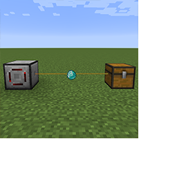

---
navigation:
  title: "Overview"
  icon: "minecraft:cake"
  parent: modularrouters:intro.md
---

# Overview

Welcome to Modular Routers!

This is a highly flexible mod for moving items around the world in various ways.  With a single block - the *Modular Router* - and one or more plug-in *modules*, you can pull items from any inventory, send them to other inventories near & far, place items as blocks, break blocks, drop items into the world, sort items, and much more.

*Think of it like a super-configurable Hopper on steroids...*

TODO: Unsupported flag 'border'

