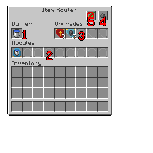

---
navigation:
  title: "Modular Router"
  icon: "modularrouters:modular_router"
  parent: modularrouters:router.md
item_ids:
  - modularrouters:modular_router
---

# Modular Router

The *Modular Router* is the core of the routing system. It is responsible for executing all the modules plugged into it; moving items, blocks and fluids around in various ways.

*An Modular Router GUI with several modules and upgrades installed

TODO: Unsupported flag 'border'

## 1. The Buffer

The *Modular Router** has a one-slot buffer, able to hold up to stack of items. This buffer is exposed as a normal inventory, so it can be interacted with via *Hoppers* and other mod piping systems.

In addition, a *Comparator* placed against the router will measure the slot's fullness as expected.

## 2. Module Slots

The *Modular Router* has nine slots for [modules](../intro/modules.md). Each time the router runs (between 1 and 10 times per second depending on Speed Upgrades), it will *execute* each module in turn, from left to right.

You can configure installed modules without removing them from the router by pressing <Color id="dark_red">**[$(k:modularrouters.configure)]$(/k:modularrouters.configure)**</Color> while hovering over it, or *Middle-Clicking* the module in the GUI.

## 3. Upgrade Slots

The *Modular Router* has five slots for [upgrades](../intro/upgrades.md). Upgrades enhance the router's functionality in various ways; for example, each inserted [Speed Upgrade](../upgrades/speed.md) makes the router tick a little faster, while each [Stack Upgrade](../upgrades/stack.md) allows it to handle more items in each operation.

## 4. Redstone Control

The *Modular Router* has some flexibility over how it responds to redstone input, controlled by the top-right button:
- Default: always run, regardless of redstone signal
- Only run when there is *no* redstone signal
- Only run when there *is* a redstone signal
- Never run
- Run *once* when a redstone pulse is received (any signal higher than previously).

## 5. Eco Mode

In the spirit of being environmentally-friendly, the router has an option to automatically slow down if it's been idle for a while.

When Eco Mode is enabled, if the router has done no work in the last <Color hex="#880">$(t:Adjustable in mod config - 'ecoTimeout')5 seconds$(/t:Adjustable in mod config - 'ecoTimeout')</Color> then it will slow down and only tick once every <Color hex="#880">$(t:Adjustable in mod config - 'lowPowerTickRate')5 seconds$(/t:Adjustable in mod config - 'lowPowerTickRate')</Color> (regardless of [Speed Upgrades](../upgrades/speed.md)). However, as soon as it does any work, it will return to normal tick speed.

## Eco Mode (cont)

This is primarily intended for busy servers, to save on CPU cycles, but it's potentially nice-to-have for any router that only runs rarely and where rapid item transfer isn't that important (e.g. a sheep farm where you might have a [Vacuum Module](../modules/vacuum.md) gathering sheared wool periodically).

<Recipe id="modularrouters:modular_router" />

