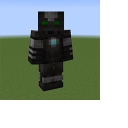

---
navigation:
  title: "Pneumatic Armor Overview"
  icon: "minecraft:written_book"
  parent: pneumaticcraft:armor.md
---

# Pneumatic Armor Overview

What if you mix <Color hex="#228">PneumaticCraft: Repressurized</Color> with the HUD from *Iron Man*? You get *Pneumatic Armor*!

Although this armor was inspired by Tony Stark's toy, it doesn't mean it's invincible in any way: by default, the armor has only slightly better protection and durability than the equivalent *Iron Armor* piece. 

Compressed Iron Man

TODO: Unsupported flag 'border'

However, this armor is highly upgradable. To use upgrades (and to pressurize the armor), put the armor in a [Charging Station](../charging_station.md).

Upgrades common to all pieces are described in the following pages. Piece-specific upgrades are described separately in the pages for each armor piece.

When you equip an armor piece, it will *boot up* within a few seconds. You can press *$(k:pneumaticcraft.armor.options)$(/k:pneumaticcraft.armor.options)* to open a GUI, which allows you to configure installed upgrades and adjust the armor HUD. With more upgrades installed, more options will appear in the GUI.

Note that all upgrades can be toggled on/off via the GUI checkboxes, and you can even bind a key to each checkbox to quickly toggle features when outside the GUI.

## Repairing

<ItemImage id="minecraft:anvil" />

There are a few ways to keep your valuable armor in good condition:
- It can be repaired in an *Anvil* with Compressed Iron Ingots
- Add *Item Life Upgrades* to each piece to have it repair itself
- Apply the *Mending* enchantment to each piece

## Coloring

Every armor piece is dynamically re-colorable from the default grey texture; each piece has a *primary* and *secondary* color which can be adjusted independently, and the Helmet *eyepiece* can also have its own color.

To adjust colors, just use the **Colors...** screen from the main armor GUI screen. No special upgrades are needed for this; it's builtin functionality!

<ItemImage id="pneumaticcraft:speed_upgrade" />

[Speed Upgrades](../upgrades.md#speed) reduce the startup time of each armor piece. In addition, they reduce the [Helmet](./pneumatic_helmet.md) lock-on time for [Entity Tracker](../upgrades.md#entity_tracker) and [Block Tracker](../upgrades.md#block_tracker), and increase the [Leggings](./pneumatic_leggings.md) run speed, but at an [air cost](../pressure.md).

<ItemImage id="pneumaticcraft:volume_upgrade" />

[Volume Upgrades](../upgrades.md#volume) increase the [air storage capacity](../pressure.md) of each armor piece, making them take longer to charge, but slower to lose pressure when in use. Volume Upgrades are limited to 25, and there are diminishing returns as you add more and more upgrades.

<ItemImage id="pneumaticcraft:armor_upgrade" />

[Armor Upgrades](../upgrades.md#armor) increase the protection and toughness of each armor piece. With 2 upgrades installed, each piece is as good as the corresponding *Diamond Armor* piece.  With the maximum 4 upgrades, the protection is thus superior to *Diamond Armor*.

<ItemImage id="pneumaticcraft:item_life_upgrade" />

[Item Life Upgrades](../upgrades.md#item_life) slowly repair the armor piece, at a cost of [air](../pressure.md). Up to 5 upgrades can be installed in each piece, providing incrementally faster (but less air-efficient) repair.

<ItemImage id="pneumaticcraft:gilded_upgrade" />

A [Gilded Upgrade](../upgrades.md#gilded) can be installed in any armor piece, and fools *Piglins* into believing that you're actually wearing *Gold Armor*. Silly Piglins.

## Mekanism Radiation

<ItemImage id="pneumaticcraft:radiation_shielding_upgrade" />

The [Radiation Shielding Upgrade](../upgrades.md#radiation_shielding) provides protection against the harmful effects of Mekanism radiation, same as Mekanism's own [Radiation Shielding Unit](https://wiki.aidancbrady.com/wiki/Radiation_Shielding_Unit). Note that you must have a Shielding Upgrade in every armor piece to receive full protection.

## Thaumcraft

[Thaumcraft Upgrades](../upgrades.md#thaumcraft) provide the armor piece with the equivalent vis discount of the corresponding *Thaumaturge's armor*.  In addition, a Thaumcraft Upgrade installed in the [Helmet](./helmet.md) acts as a *Goggles of Revealing*, showing *aura nodes* and displaying *aspect* amounts in containers.

