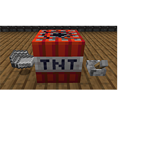

---
navigation:
  title: 'Basic Materials'
  icon: 'pneumaticcraft:ingot_iron_compressed'
  parent: pneumaticcraft:base_concepts.md
item_ids:
  - pneumaticcraft:compressed_iron_block
---

# Basic Materials

<Color id="dark_green">PneumaticCraft: Repressurized</Color> does not generate any extra ores in the ground. To get started, you just need _Iron Ingots_, which you will convert into _Compressed Iron Ingots_, used in many recipes throughout the mod.

To do this, throw your _Iron Ingots_ on the ground, and cause a nearby explosion. _TNT_ will do the trick, but any other explosion works too.

-      Step back*



<a name="compressed_iron_ingot"></a>
<ItemImage id="pneumaticcraft:ingot_iron_compressed" />

Warning: as a side effect of the explosion you will lose around 20% of your ingots. To avoid this, you can also craft _Compressed Iron Ingots_ in a [Pressure Chamber](../manufacturing/pressure_chamber.md). However, to be able to craft the _Pressure Chamber_ itself you'll need some _Compressed Iron Ingots_, so a little initial loss is unavoidable.

**TODO:** Unsupported Patchouli page type **pneumaticcraft:pressure_chamber**

```
{"type":"pneumaticcraft:pressure_chamber","recipe":"pneumaticcraft:pressure_chamber/compressed_iron_ingot"}
```

<a name="compressed_iron_block"></a>
The _Block of Compressed Iron_ is an excellent [Heat Conductor](./heat.md) and can be used to provide more faces to attach [Heat Sinks](../machines/heat_sink.md) to heat-producing machines. However, see also [Heat Pipes](../machines/heat_pipe.md).

<Recipe id="pneumaticcraft:compressed_iron_block_from_ingot" />

**TODO:** Unsupported Patchouli page type **pneumaticcraft:pressure_chamber**

```
{"type":"pneumaticcraft:pressure_chamber","recipe":"pneumaticcraft:pressure_chamber/compressed_iron_block"}
```
