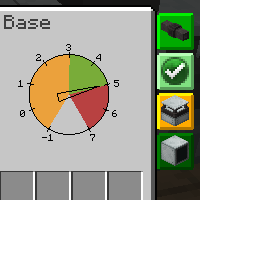

---
navigation:
  title: "GUI Concepts"
  icon: "pneumaticcraft:textures/gui/icon/gui_mouse.png"
  parent: pneumaticcraft:base_concepts.md
---

# GUI Concepts

Most machines in <Color hex="#228">PneumaticCraft: Repressurized</Color> have a GUI with several *side tabs*. Some tabs are common to most or all machines, while some are unique to certain machines. Here is a list of some common tabs:

- **Redstone behaviour**: In here you can select how a machine responds to redstone or when it should emit redstone.
- **Information **: The info tab shows (static) information about what the machine is used for.
- **Upgrades **: In here you can read about the upgrades this machine accepts, and what they do in the machine's context.

- **Pressure Status**: Here you can find current pressure the machine is under and the volume of the machine.
- **Problems **: If the machine doesn't work, this tab will point you in the right direction about what's wrong.

A GUI showing 3 side tabs: Pressure Status, Problems (none here) and a machine-specific Assembly Controller Status

TODO: Unsupported flag 'border'

