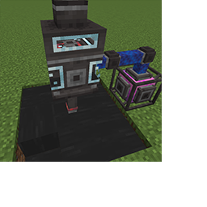

---
navigation:
  title: "Crude Oil"
  icon: "pneumaticcraft:oil_bucket"
  parent: pneumaticcraft:base_concepts.md
---

# Crude Oil

In <Color hex="#228">PneumaticCraft: Repressurized</Color>, the only world generation is *Crude Oil*. It's generated similarly to water lakes; the difference is that Oil lakes are far more likely to spawn deep underground than on the surface. Because of this, assistance from tools like a [Seismic Sensor](../seismic_sensor.md) is highly recommended.

Crude Oil has two purposes: to be [refined](../refinery.md) into high-quality fuels which can be used in [Liquid Compressors](../liquid_compressor.md), and for making [Plastic](../plastic.md) and [Lubricant](../lubricant.md).

*Plastic* is used in many recipes in <Color hex="#228">PneumaticCraft: Repressurized</Color>, and *Lubricant* is required for making [Speed Upgrades](./upgrades.md#speed).

Once you've found some Crude Oil, you'll need to extract and transport it. The recommended <Color hex="#228">PneumaticCraft: Repressurized</Color> way to extract oil is with a [Gas Lift](../gas_lift.md), although fluid pumps from other mods can also be used. If you're pumping far from your base, one early game solution for transport is a simple [Small Tank](../tanks.md), which can hold up to 32,000mB of fluid and keeps its contents when broken. (Even the Gas Lift can be used for this purpose since it also keeps its fluid contents).

*Pumping Oil with a Gas Lift, with a Liquid Hopper above*

## Mod Integration

<Color hex="#228">PneumaticCraft: Repressurized</Color> is of course not the only mod to add *Oil*; several other mods do too (including *BuildCraft* and *Immersive Petroleum*).

Depending on your worldgen settings, <Color hex="#228">PneumaticCraft: Repressurized</Color> Oil might not be available; however, the [Refinery](../refinery.md) is capable of handling the "oil" fluid from other mods.

