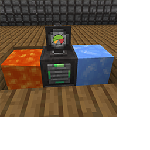

---
navigation:
  title: "Thermal Compressor"
  icon: "pneumaticcraft:thermal_compressor"
  parent: pneumaticcraft:compressors.md
item_ids:
  - pneumaticcraft:thermal_compressor
---

# Thermal Compressor

The *Thermal Compressor* is a simple compressor which uses the [temperature](../heat.md) differential on opposite (horizontal) sides to produce [compressed air](../pressure.md). The greater the temperature gradient, the more air that is produced.

Note: trying to run this compressor purely from a [Vortex Tube](../vortex_tube.md) won't work; you will get a net pressure loss.

*A Thermal Compressor using Lava and Packed Ice to provide a temperature gradient*

TODO: Unsupported flag 'border'

The *Thermal Compressor's* North-South and East-West faces are thermally connected to another, but there's no cross-connection between N-S or E-W, so you can have two independent temperature gradients on one compressor.

Heat will equalize across the connections, so some effort will be required to maintain a useful temperature differential.

## Applications

There are three primary situations where the *Thermal Compressor* may be of use:
- To utilise waste heat (or cold!) from *one* side of a *Vortex Tube*. Normally you will only be using the hot or cold side of a Vortex Tube, and venting the other side via a [Heat Sink](../heat_sink.md). However, the *Thermal Compressor* offers the opportunity to reclaim some of this waste heat or cold as air pressure.

## Applications (cont.)

- To utilise the waste heat from advanced compressors such as the [Advanced Air Compressor](./advanced_air_compressor.md). Normally you would dump this heat into the atmosphere using one or more [Heat Sinks](../heat_sink.md), but with the Thermal Compressor, it's also possible to reclaim some of this waste heat as pressure.

## Applications (cont.)

- If you have the means to obtain large quantities of naturally hot or cold substances, e.g. [lava, or blocks from other mods](../heat_sources.md), you may be able to use them to generate some pressure. You will likely also need to be able to automate the placement and removal of heat sources and spent sources; [Drones](../drone.md) can do this, as can many other modded solutions.

## Redstone Control

This compressor can be controlled by a <Color hex="#f00">redstone signal</Color>; if disabled, pressure generation stops, and the thermal resistance between the North-South and East-West faces greatly increases (a little heat will still leak across, but far less than when the compressor is running). This can be useful to store up energy as a heat differential when pressure is not needed, e.g. when your tube network is fully pressurized.

Crafting a *Thermal Compressor*

<Recipe id="pneumaticcraft:thermal_compressor" />

