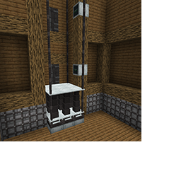

---
navigation:
  title: 'Elevators'
  icon: 'pneumaticcraft:elevator_base'
  parent: pneumaticcraft:machines.md
item_ids:
  - pneumaticcraft:elevator_base
  - pneumaticcraft:elevator_frame
  - pneumaticcraft:elevator_caller
---

# Elevators

The _Elevator_ is a machine that can be used to vertically transport any entities, whether it be an item, mob, animal or player.

You need to place an _Elevator Base_ at the bottom. You can stack multiple bases on top of each other.

On top of this, place _Elevator Frames_, which act as a support for the elevator.

Both the number of _Elevator Bases_ and the number of _Elevator Frames_ determine how high the _Elevator_ can extend. The maximum height of an _Elevator_ is the lower of:

- 1 x the number of vertically-stacked _Elevator Frames_, or
- <Color id='dark_purple'>$(t:You can change this multiplier in mod config - see 'I:elevatorBaseBlocksPerBase')6 x$(/t:You can change this multiplier in mod config - see 'I:elevatorBaseBlocksPerBase')</Color> the number of vertically-stacked _Elevator Bases_

The _Elevator_ can operate in one of two modes:

- **Redstone**: a <Color id="red">redstone signal</Color> applied to any _Elevator Base_ controls the elevator's height, proportional to the signal strength (no signal = 0% extension, full signal = 100% extension).
- **Elevator Caller**: The [Elevator Caller](#caller) can provide some more sophisticated control over the elevator.

## Multiblock Elevators

You can create bigger _Elevators_ by placing more _Elevator Bases_ next to each other horizontally. When the top _Elevator Base_ of every connected _Elevator_ is at the same height, the _Elevators_ will share the floors (defined by [Elevator Callers](#caller)), redstone input, and therefore act as a single multiblock.

## Saving Air

The _Elevator Base_ can accept up to four [Charging Upgrades](../base_concepts/upgrades.md#charging), which allow it to reclaim used air when the elevator descends (normally descent costs no air but does not regenerate air either).

This comes at a cost of slower descent; with 4 upgrades installed, air is reclaimed at 60% of the cost to rise that distance, but descent will be 40% slower.

## Elevator Caller

_Elevator Callers_ placed next to _Elevator Frames_ are used to control the height of the _Elevator_. When you place down an _Elevator Frame_, it'll calculate how many _floors_ there are, defined by other _Elevator Callers_.

_Floors_ can be named in the _Elevator Base_ GUI; floor names will be displayed as buttons on each _Elevator Caller_. They can be clicked to call the _Elevator_ to that floor.

## Elevator Caller (cont.)

In addition, an _Elevator Caller_ will emit a <Color id="red">redstone signal</Color> when the _Elevator_ is at its floor, and providing a Caller with a <Color id="red">redstone pulse</Color> will call the _Elevator_ to its floor.

Finally, the _Elevator Caller_ can be camouflaged to look like other blocks with the [Camouflage Applicator](../tools/camo_applicator.md) tool.

_A 3x3 Elevator with two visible Elevator Callers_

TODO: Unsupported flag 'border'

<Recipe id="pneumaticcraft:elevator_base_1" />

<Recipe id="pneumaticcraft:elevator_frame" />

<Recipe id="pneumaticcraft:elevator_caller" />
